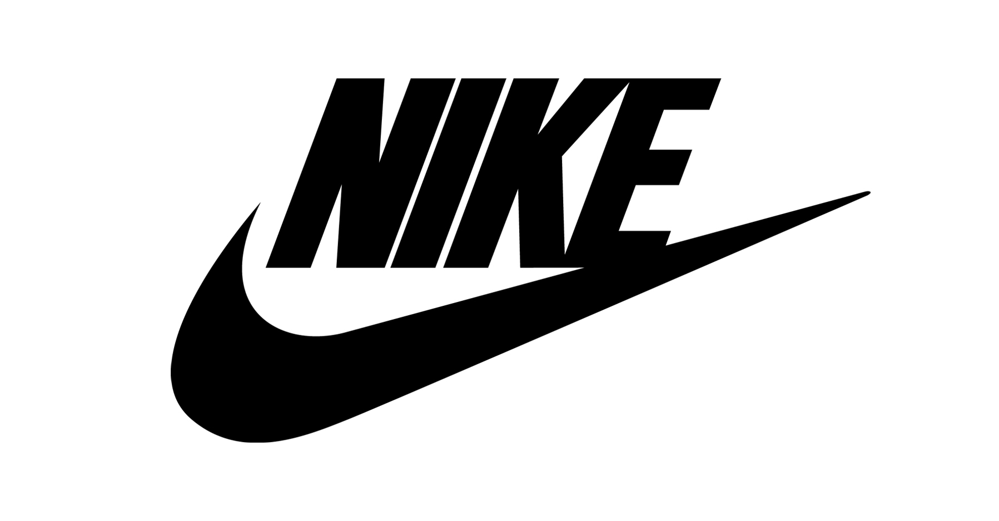
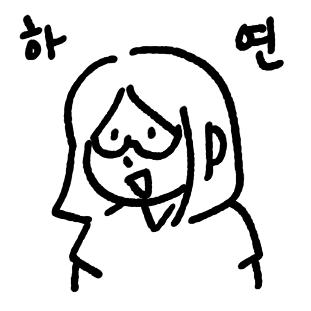
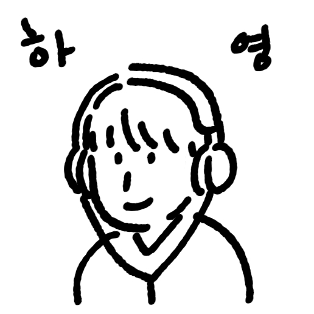
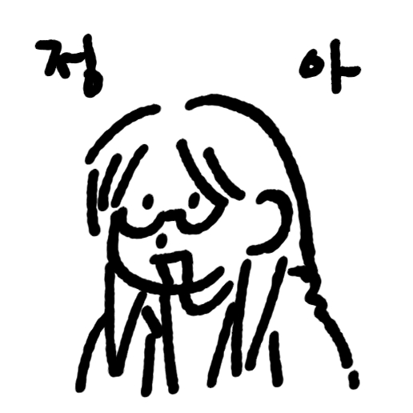
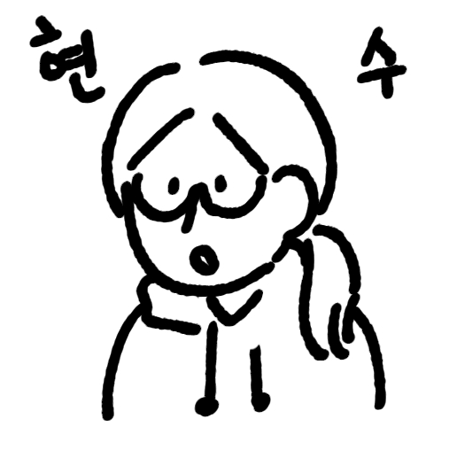

# 1조: 코딩 네 스푼 🥄🥄🥄🥄

 ⬆️ 이미지를 클릭하여 배포 사이트를 확인하세요.
 
 

# JUST DO IT!

### '코딩 네 스푼'은 글로벌 브랜드 나이키의 모바일 쇼핑 경험을 재현하여,

### 실제 구매자가 원하는 서비스를 제공하는 것을 목표로 프로젝트를 진행했습니다.

 
 

## 🕒 개발 기간

> 2025.11.10-2025.11.24 (총 15일)

 

## 👥 팀원 및 역할 소개

|  |  |  |  |
| :-------------------------------------------------: | :-------------------------------------------------: | :-------------------------------------------------: | :-------------------------------------------------: |
|                    **🐰 김하연**                    |                    **🍀 이하영**                    |                    **🐢 한정아**                    |                    **☃️ 김현수**                    |
|                      PM(팀장)                       |                         PL                          |                        서기                         |                        발표                         |
|                     상품 리스트                     |                      제품 상세                      |              메인 홈, 로그인&회원가입               |                      장바구니                       |

 

## 📢 발표 타임라인

#### **- 프로젝트 소개**

#### **- 기술 스택 및 개발 환경**

#### **- 기술 구현 상세 및 기능 시연**

#### **- 회고 및 추후 개선하고 싶은 점**

 
 
 
 

## 📝 프로젝트 소개

### 프로젝트 선택 배경

- 모바일 쇼핑의 일상화
- 사용자 중심 UI/UX 중요성 증가
- 글로벌 브랜드 사례를 통한 학습 필요성

### 학습한 점

- 나이키의 직관적인 UI: 사용자에게 직관적이고 빠른 탐색 경험을 제공하는 디자인
- 모바일 중심의 구매 흐름: 모바일 쇼핑 환경에 최적화된 기능과 흐름 설계
- 사용자 편의성을 고려한 기능 구성: 효율적이고 사용자 중심의 인터페이스 설계

 
 
 

## ⚙️ 기술 스택 및 개발 환경

| 분류             | 툴                                                                                                                                                                                                                                                                                                                                                                                                                  |
| ---------------- | ------------------------------------------------------------------------------------------------------------------------------------------------------------------------------------------------------------------------------------------------------------------------------------------------------------------------------------------------------------------------------------------------------------------- |
| **기술 스택**    |                                                                                                                                                                                               |
| **UI/UX**        |                                                                                                                                                                                                                                                                                                                  |
| **개발 환경**    |                                                                                                                                                                                           |
| **커뮤니케이션** |     |
| **배포**         |                                                                                                                                                                                                                                                                                                              |

 
 
 

## 🖥️ 기술 구현 상세 및 기능 시연

### 메인 홈

- **헤더:** 상품검색기능(작업미정) / 마이페이지→로그인 / 장바구니(링크) / 더보기-모달 창 
- **모달창:** 회원가입, 로그인 / 상품리스트, 장바구니 링크 
- **메인화면 구성 3가지:** 버튼 링크 연결 / 각 선택 가능 항목마다 hover기능 / 오버플로우 스트롤 
- **푸터:** 아코디언
   
   

### 로그인&회원가입

- **로그인:** 로그인 시 이메일 확인 → 회원일 시 비밀번호 입력 후 로그인 / 비회원일 시 비회원 문구 출력 후 회원가입(권한동의) 
- **회원가입:** 권한동의, 회원가입(필수 입력사항 미입력시 안넘어감)기능, 메인화면으로 이동 
- **권한 동의:** 모두 동의 박스 체크시 모든 input박스 체크 / 모든 박스 체크시 ‘계속’버튼 활성화 / 버튼 hover기능
   
   

### 상품 리스트

- **메인 카테고리별 상품 목록 조회:** 상단 햄버거 버튼을 누른 후 카테고리 버튼을 눌렀을 때도 누른 카테고리에 맞는 상품이 렌더링 됨. 
- **결과 텍스트 상품 개수와 연동:** 몇 개의 결과가 나오는지 알려주는 텍스트를 실제 리스트에 보이는 상품 개수와 동일하도록 만듦. 
- **페이지 처리 방식:** 스크롤 시 스크롤이 바닥에 닿았을 때 4개씩 추가로 상품이 더 보이도록 무한 스크롤 기능 추가
   
   

### 제품 상세

- **색상 선택 + 재고여부 확인:** 상품검색기능(작업미정) / 마이페이지→로그인 / 장바구니(링크) / 더보기-모달 창 
- **사이즈 선택 + 재고여부 확인:** 사이즈 선택 기능 연결 완료 
- **장바구니에 담기:** 로그인 시: 사이즈 선택 후 장바구니 추가 기능 연결 완료 / 비로그인 시: 로그인이 필요하다는 문구 출력 
- **위시리스트 추가:** 위시리스트 추가 기능 연결 완료 
- **추천 제품 목록:** 현재 보고 있는 제품의 카테고리와 일치하는 제품을 추천하는 기능 연결 완료
   
   

### 장바구니

- **장바구니 상품 목록 조회:** 장바구니에 담겨져 있는 상품의 목록들을 조회 
- **수량 수정:** 플러스, 마이너스를 버튼을 클릭 시 상품의 수량과 총 금액을 변경 
- **찜하기:** 빈 하트 아이콘 클릭 시 채워진 하트로 변경 
- **삭제:** 휴지통 아이콘 클릭 시 장바구니에서 해당 상품을 삭제
   
   

 

## 💡 회고 및 추후 보완하고 싶은 점

| **팀원**      | **회고**                                                                                                                                                                                                                                         | **추후 개선하고 싶은 점**                 |
| ------------- | ------------------------------------------------------------------------------------------------------------------------------------------------------------------------------------------------------------------------------------------------ | ----------------------------------------- |
| **🐰 김하연** |                                                                                                                                                                                                                                                  |                                           |
| **🍀 이하영** |                                                                                                                                                                                                                                                  |                                           |
| **🐢 한정아** |                                                                                                                                                                                                                                                  |                                           |
| **☃️ 김현수** | 기획 단계부터 어느 부분이 많은 시간을 소요하는 지에 대해 명확히 판단하고 작업해야겠다는 생각이 들었다. 프로젝트가 끝나갈수록 각종 오류와 싸우느라 API 연결을 하지 못한 것이 매우 아쉽고, 아직 개발자로 성장하기에는 부족하다는 것을 많이 느꼈다. | API를 연결해 프로젝트를 마무리 짓고 싶다. |
